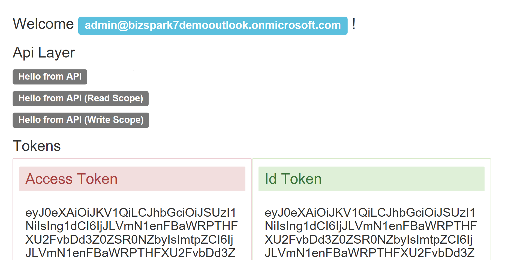

# Azure AD Secured Api access (Asp.Net Core 2.0)

Small example of a two tiers application with a FrontEnd application that calls a backend Api application. Both coded with **Asp.Net Core 2.0** and secured with the same Azure Ad tenant (directory).
This demonstrate how to retrieve an access token from AzureAd, using the implicit flow (**OpenIdConnect**):


## Document
For more detailed information read the following [post](https://blogs.msdn.microsoft.com/gianlucb/2017/10/04/access-an-azure-ad-secured-api-with-asp-net-core-2-0/?preview_id=255&preview_nonce=7228ed3d1b&_thumbnail_id=265&preview=true)


## Setup
Using the Azure portal you need to:
+ create two Azure Applications in your tenant
    + FrontEnd
        + Reply Url: "http://localhost:10001/signin-oidc"
        + App ID Uri: "http://AAD.2tiers.Web" 
    + Api
        + Reply Url: "http://localhost:10000"
        + App ID Uri: "http://AAD.2tiers.Api" 
+ allows the FrontEnd application to access Api (permission tab, add)
+ Edit the manifest of the FrontEnd application and enable the implicit flow (**"oauth2AllowImplicitFlow"**: **true**).

To automated these tasks you can use the powershell script **Create2TiersAADDemo.ps1**.

Last point is edit the **appsettings.json** files with your settings:

```json
    "Domain": "ZZZZZZZZZ.onmicrosoft.com",
    "TenantId": "your tenant ID",
    "ClientId": "your Application ID"
```

for the FrontEnd application add also the Application ID of the Api layer
    
```json
    "TargetApiAppId": "597add50-a83e-4930-8f8f-YYYYYYYY"
```

Browse to http://localhost:10001 and login with an account in your tenant:




